# 03 — Results

Numbers from the latest reproducible pipeline run (`python3 main.py`).

---

## Case 1 — Classification (holdout test)

| Model | F1 | ROC-AUC | PR-AUC | Precision | Recall | Brier | ECE |
|-------|---:|--------:|-------:|----------:|-------:|------:|----:|
| **RandomForest** | **0.661** | 0.856 | **0.680** | 0.573 | 0.781 | 0.131 | **0.016** |
| XGBoost | 0.659 | **0.858** | 0.669 | 0.562 | 0.797 | 0.132 | 0.025 |
| LogisticRegression | 0.643 | 0.853 | 0.678 | 0.534 | **0.810** | 0.131 | 0.026 |

**Best by F1:** RandomForest.  
Logistic Regression maximizes recall (more FPs): useful when visit cost is low.

### Thresholds (RandomForest, from val)

| Concept | Value |
|---------|------:|
| `threshold_opt` (F1) | ~0.27 |
| `risk_threshold_medium` | ~0.32 |
| `risk_threshold_high` | ~0.47 |
| Cost-based threshold (`FN=5×FP`) | ~0.21 |

Takeaway: with imbalance + expensive FNs, the business-optimal threshold **drops** below 0.5.

### ROC & Precision-Recall

  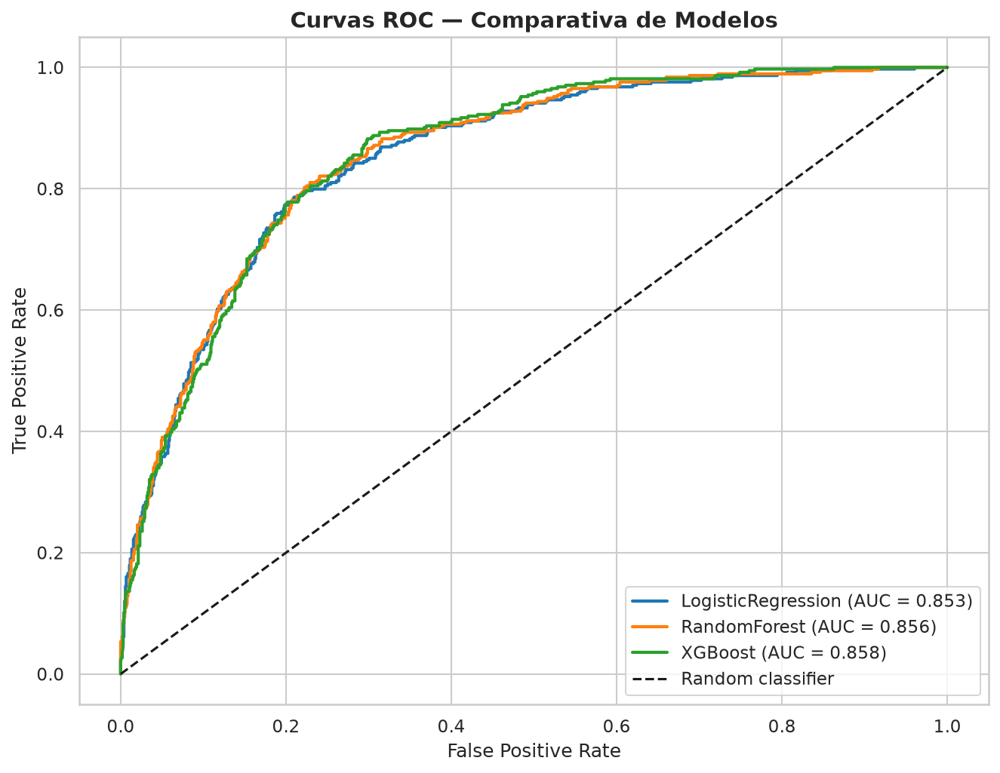

  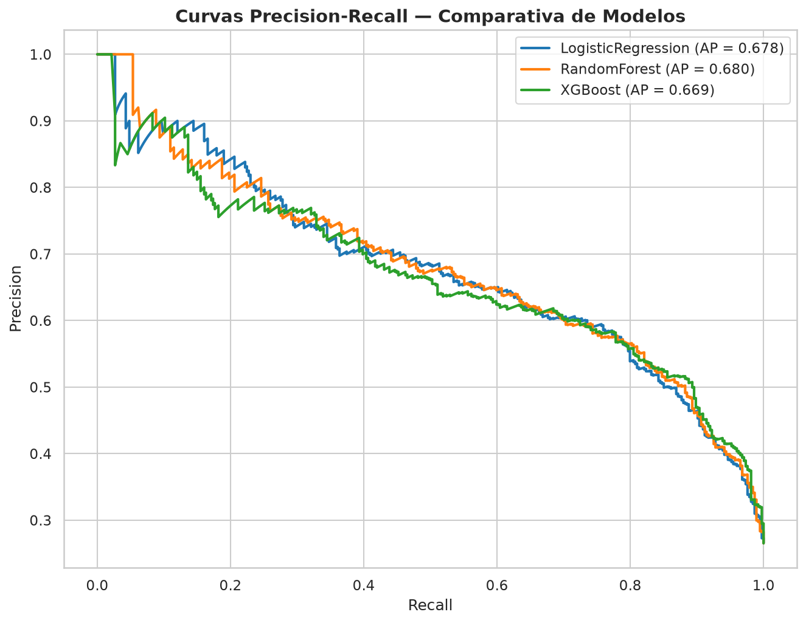

### Calibration & cost curve

  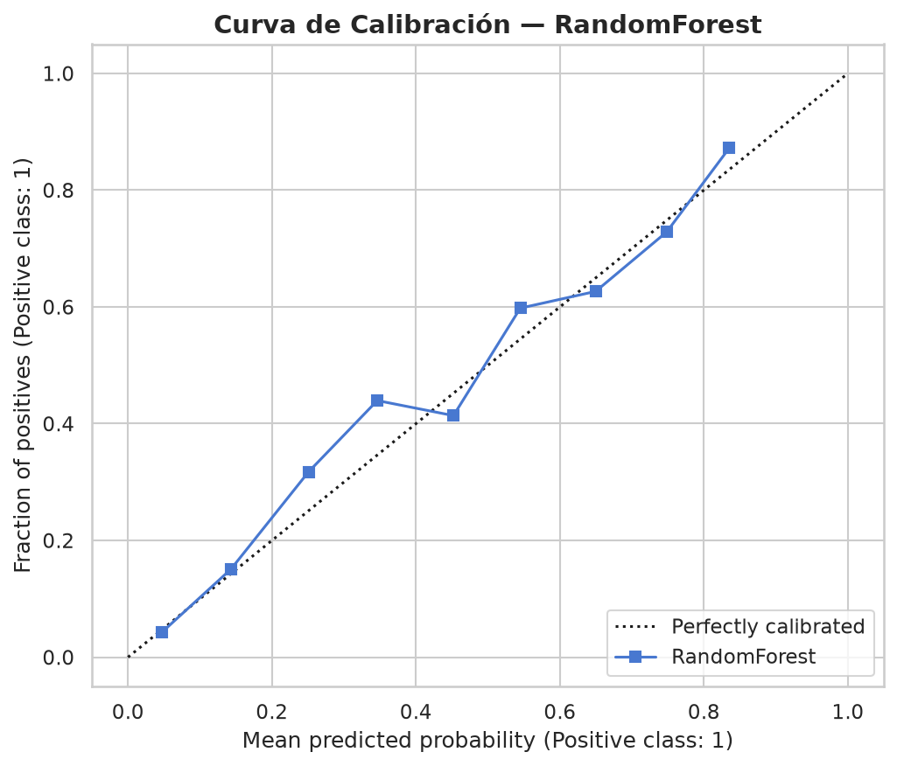

  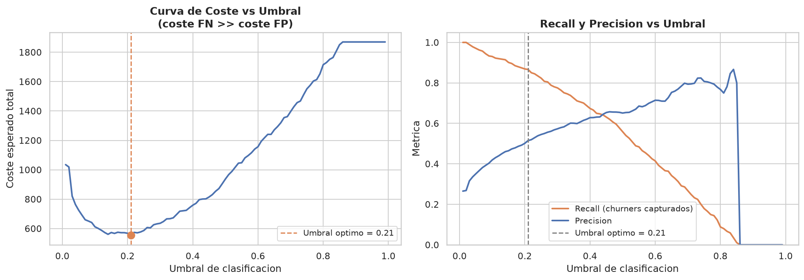

### SHAP (RandomForest)

  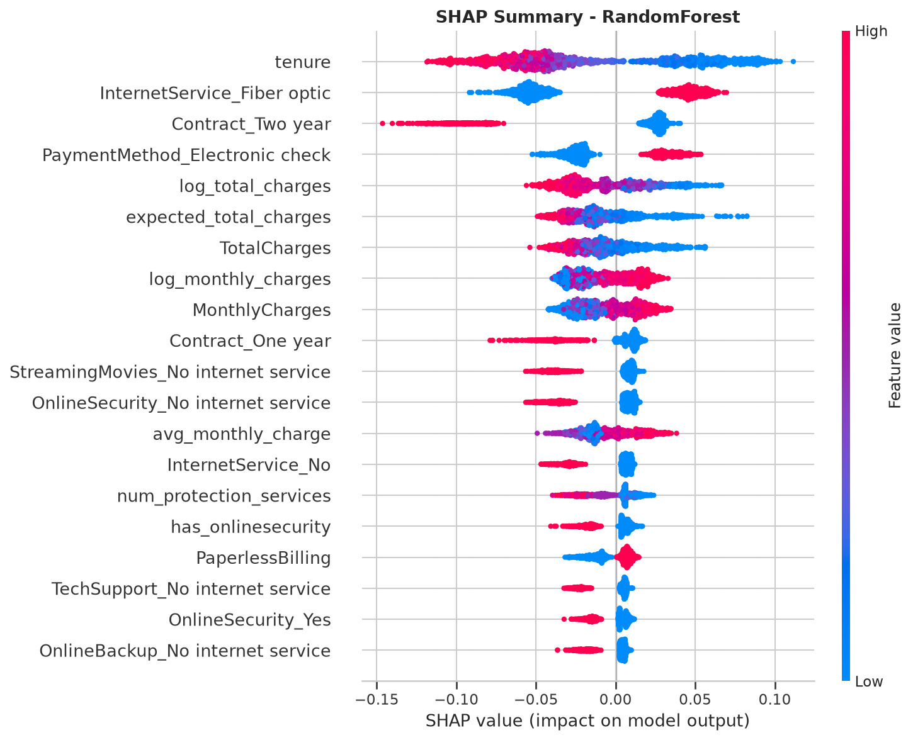

---

## Lift / Gains (business)

| Decile | Customers | Churners | Churn rate | Lift | Cum. customers | Cum. recall | Cum. lift |
|------:|----------:|---------:|-----------:|-----:|---------------:|------------:|----------:|
| 1 | 140 | 106 | 75.7% | **2.85×** | 9.9% | 28.3% | **2.85×** |
| 2 | 141 | 84 | 59.6% | 2.24× | 19.9% | 50.8% | **2.55×** |
| 3 | 141 | 68 | 48.2% | 1.82× | 30.0% | 69.0% | **2.30×** |
| 4 | 141 | 49 | 34.8% | 1.31× | 40.0% | 82.1% | 2.05× |
| 5 | 141 | 27 | 19.2% | 0.72× | 50.0% | 89.3% | 1.79× |
| 6 | 141 | 13 | 9.2% | 0.35× | 60.0% | 92.8% | 1.55× |
| 7 | 141 | 16 | 11.3% | 0.43× | 70.0% | 97.1% | 1.39× |
| 8 | 141 | 7 | 5.0% | 0.19× | 80.0% | 98.9% | 1.24× |
| 9 | 141 | 2 | 1.4% | 0.05× | 90.0% | 99.5% | 1.11× |
| 10 | 141 | 2 | 1.4% | 0.05× | 100% | 100% | 1.00× |

| If you contact… | % of churners captured | Cumulative lift |
|-----------------|-----------------------:|----------------:|
| Top ~10% | ~28% | **2.85×** |
| Top ~20% | ~51% | **2.55×** |
| Top ~30% | ~69% | **2.30×** |

  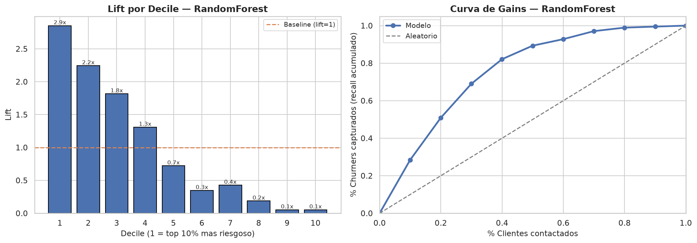

**Interpretation:** under limited visit capacity, the ranking multiplies effectiveness vs random contact.

---

## Case 2 — Commercial potential

| Model | MAE | RMSE | R² |
|-------|----:|-----:|---:|
| **XGBoost Regressor** | **0.33** | **0.58** | **0.997** |
| Ridge | 2.64 | 3.25 | 0.896 |

  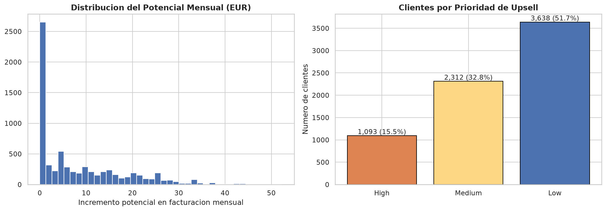

---

## Case 3 — Anomalies

- 5% contamination → ~353 anomalies
- Precision@K ≈ churn base rate (~0.26)  
  → the model detects **billing rarity**, not churn directly (expected)

  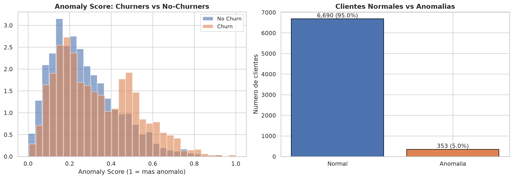

---

## Case 4 — Survival

| Result | Value |
|--------|------:|
| Concordance (Cox) | ~0.83 |
| HR `Month-to-month` | ~9.2× |
| Median survival Month-to-month | ~35 months |
| One / Two year | median not reached (`inf`) |

### Median survival by contract

| Contract | Median survival (months) | n |
|----------|-------------------------:|--:|
| Month-to-month | 35 | 3875 |
| One year | not reached | 1473 |
| Two year | not reached | 1695 |

### Cox hazard ratios

| Feature | Hazard ratio | 95% CI low | 95% CI high |
|---------|-------------:|-----------:|------------:|
| `is_month_to_month` | **9.21** | 7.94 | 10.68 |
| `electronic_check` | 1.63 | 1.48 | 1.79 |
| `is_fiber` | 1.44 | 1.22 | 1.69 |
| `paperless` | 1.17 | 1.05 | 1.30 |
| `log_monthly_charges` | 0.91 | 0.78 | 1.08 |
| `has_dependents` | 0.90 | 0.79 | 1.03 |
| `is_senior` | 0.90 | 0.81 | 1.00 |
| `has_tech_support` | 0.66 | 0.58 | 0.75 |
| `has_online_security` | 0.56 | 0.50 | 0.64 |
| `has_partner` | 0.55 | 0.49 | 0.61 |

  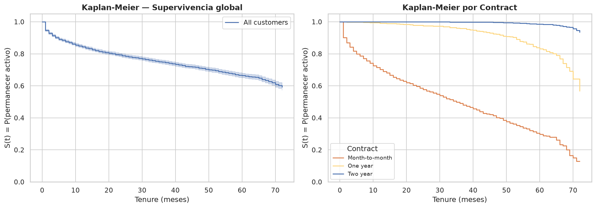

  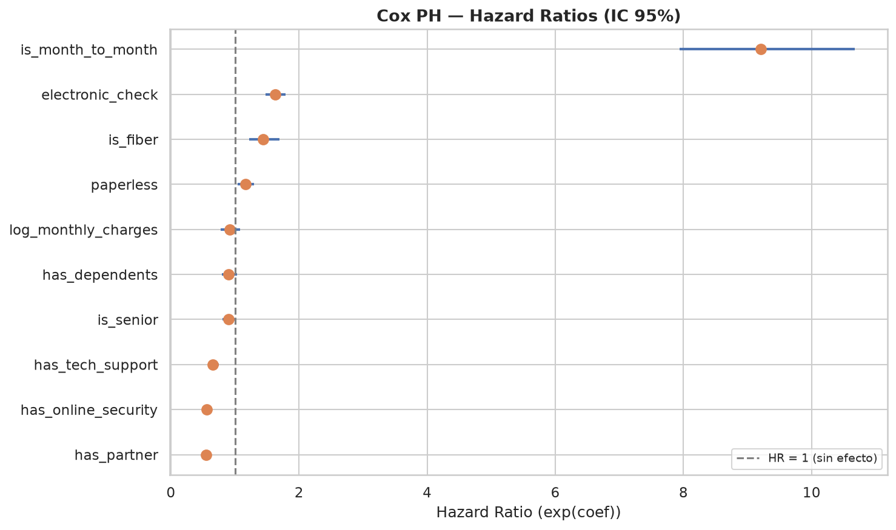

  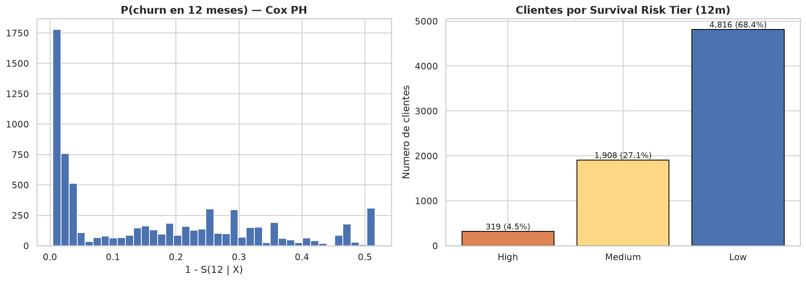

---

## Unified score

Weights: churn 0.50 / potential 0.30 / anomaly 0.20  

Typical segments: `Maintain`, `Retain_Urgent`, `Retain_HighValue`, `Grow_Upsell`, …

  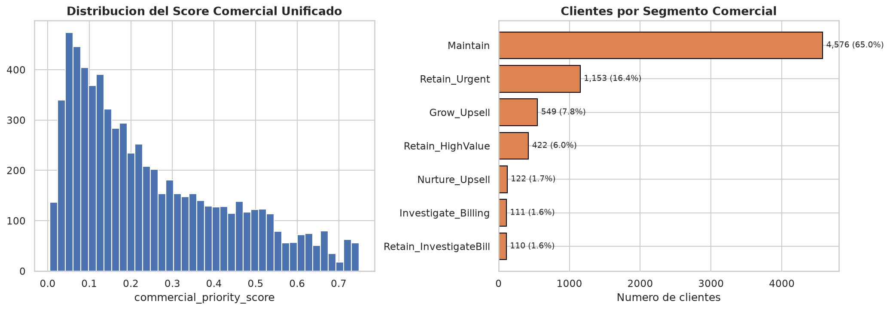

---

## Honest limitations

1. Cross-sectional snapshot → survival is approximate (not month-by-month panel data)
2. Anomalies ≠ churn predictor
3. No A/B test: lift is targeting potential, not measured causal impact
4. Telecom domain: re-validate features for other industries

---

## Navigation

← Previous: [02 — Methodology](02_methodology.md)  
→ Next: [04 — Business playbook](04_business_playbook.md)
